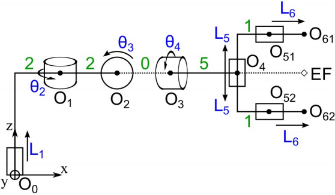

# **Robótica Computacional**  
   
**Fecha:** 1 de Febrero del 2021  

**Universidad:** Universidad de La Laguna  
**Facultad:** Escuela Superior de Ingeniería y Tecnología  
**Grado:** Ingeniería en Informática  
**Asignatura:** Robótica Computacional  
**Curso:** 4º  

---

## 📄 **Índice de Contenidos** 

- [ Directorios ](#directories)
- [ Problema ](#problem)
- [ Objetivo ](#objective)
- [ Lenguaje ](#language)
- [ Autores ](#authors)

## 📁 **Directorios** 

* code ➡️ Códigó fuente
* report ➡️ Informe 
* slides ➡️ Presentación

## 🤔 **Problema** 

*Dado un brazo robótico con un conjunto de articulaciones que permiten girar o desplazar diferentes puntos del mismo.*

La **cinemática directa** se puede definir como el problema por el cual se pretende conocer las coordenadas cartesianas en el espacio (X,Y,Z) de cada punto que conforman el brazo robótico a partir de un conjunto de parámetros o variables articulares (θ,L,...) que definen las posiciones y orientaciones de las articulaciones delbrazo robótico. 

Es decir, de forma resumida, la cinemática directa busca convertir un input de variables articulares en un output equivalente de coordenadas cartesianas en el espacio(o en el plano):

**(θ,L,...)** ➡️ **(X,Y,Z)**

## 🎯 **Objetivo** 

Resolver la cinemática directa con cuaterniones.

## 💻 **Lenguaje** 

Python

## ✒️ **Autores** 

* Miguel Ángel Ordoñez Morales - [miguel141097](https://github.com/miguel141097) 
* Javier Duque Melguizo - [JDM-ULL-93](https://github.com/JDM-ULL-93)